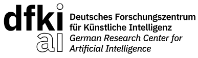
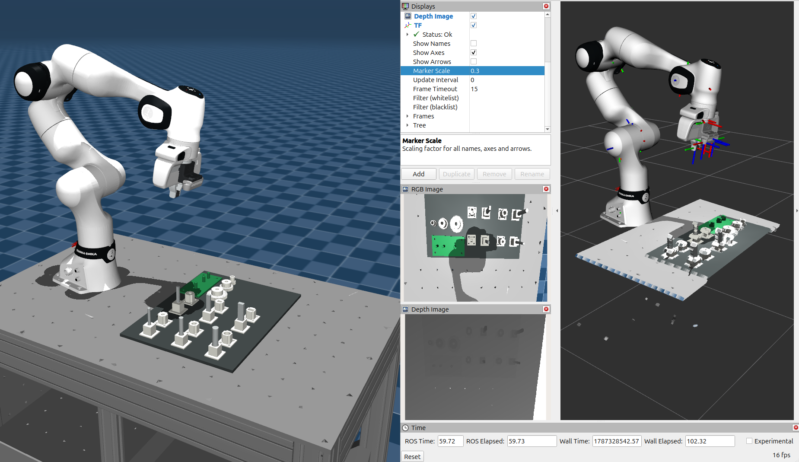
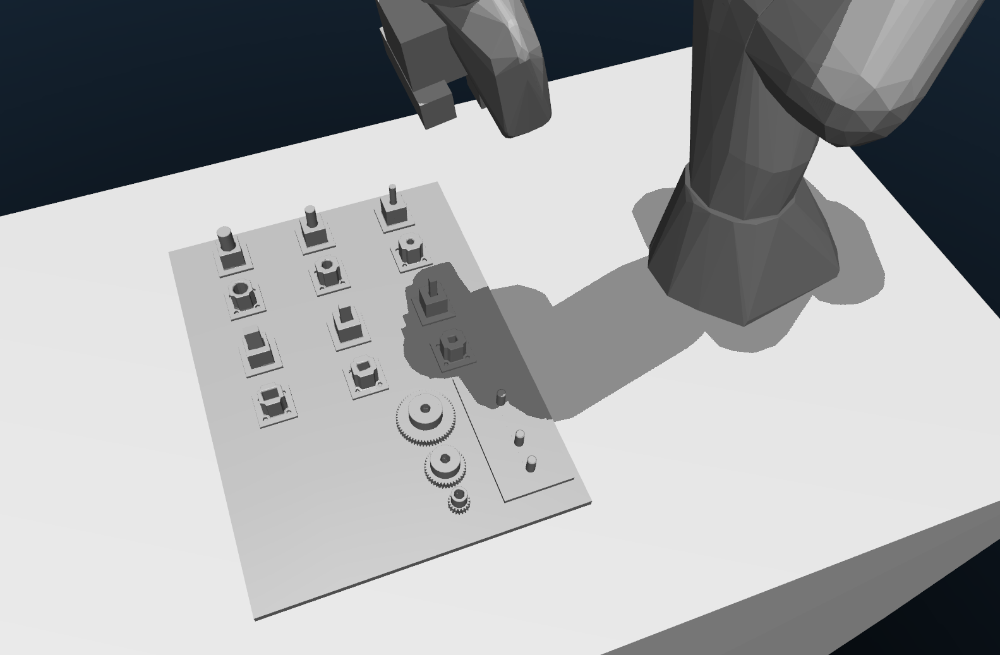
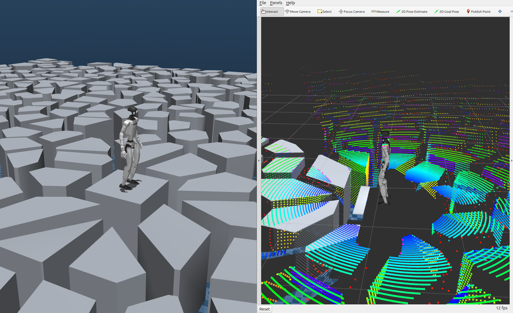
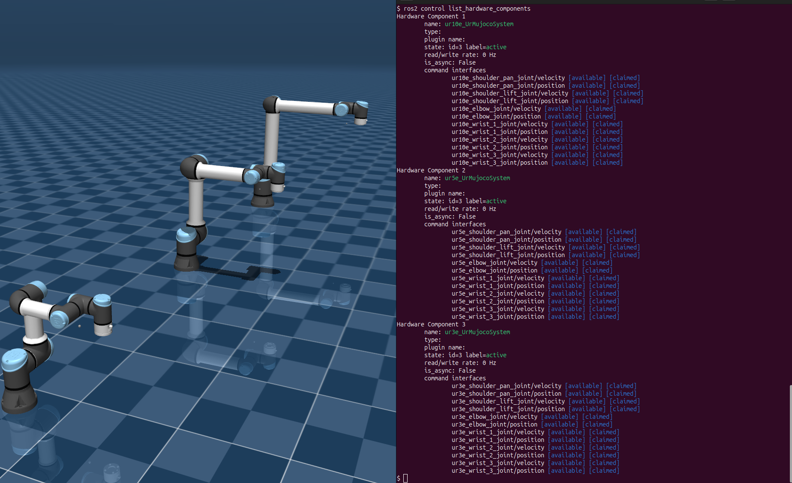

# Mujoco ROS2 Control

The MuJoCo ROS2 Control hardware interface is designed to enable seamless integration between MuJoCo, a high-performance physics engine, and ROS 2, a widely used middleware for robotic systems. This interface provides a robust and efficient solution for leveraging MuJoCo’s powerful simulation capabilities within the ROS 2 ecosystem, enabling realistic physics-based robot simulation and control.

**software name:** Mujoco ROS2 Control

Mujoco ROS2 Control was initiated and is currently developed at the
[Robotics Innovation Center](http://robotik.dfki-bremen.de/en/startpage.html) of the
[German Research Center for Artificial Intelligence (DFKI)](http://www.dfki.de) in Bremen.



## Motivation
The development and testing of control algorithms for robotic systems is a crucial step in ensuring their reliability, safety, and efficiency. However, conducting these tests on physical hardware can be expensive, time-consuming, and prone to mechanical wear and tear. To overcome these challenges, accurate and efficient physical simulations have become an indispensable tool for researchers, engineers, and roboticists. These simulations enable comprehensive testing of robot controllers, planning algorithms, and perception systems in a controlled, repeatable, and risk-free environment.

## Compatibility
| ROS 2 Version | Branch | Build & Test | Examples Build & Test |
|--------------|--------|--------------|-----------------------|
| Humble | [main](https://github.com/dfki-ric/mujoco_ros2_control) | [](https://github.com/dfki-ric/mujoco_ros2_control/actions/workflows/ci.yml?query=branch%3Amain) | [](https://github.com/dfki-ric/mujoco_ros2_control/actions/workflows/ci-examples.yml?query=branch%3Amain) |
| Jazzy | [jazzy](https://github.com/dfki-ric/mujoco_ros2_control/tree/jazzy) | [](https://github.com/dfki-ric/mujoco_ros2_control/actions/workflows/ci.yml?query=branch%3Ajazzy) | [](https://github.com/dfki-ric/mujoco_ros2_control/actions/workflows/ci-examples.yml?query=branch%3Ajazzy) |

## Examples
### Franka
Franka description and the gears from the IndustRealKit that can be started with 
```bash
  ros2 launch mujoco_ros2_control_examples franka.launch.py
```

*RGBD Camera (640x480px) inside of MuJoCo ([MuJoCo Visualizer](https://github.com/google-deepmind/mujoco/tree/main/simulate) \[left\], [rviz2](https://index.ros.org/p/rviz2/) \[right\])*


*The IndustReal task board's peg trays and gears, collision geometry as CoaCD convex-decomposes it -- high enough resolution that a tray's peg-shaped hole survives instead of being filled in by a single convex hull. See [`decompose_industreal_peg_trays`](./mujoco_ros2_control_examples/README.md#task-table-assets) in the examples README.*

### Unitree
Unitree G1 with lidar and using the prepare_terrain.py script 
```bash
  ros2 launch mujoco_ros2_control_examples unitree_g1.launch.py
```

*Unitree G1 with a floating joint between world and pelvis, standing on the Voronoi stepping-stones terrain generated by prepare_terrain.py — stones at varying heights and tilts, separated by gaps, over a pit ([MuJoCo Visualizer](https://github.com/google-deepmind/mujoco/tree/main/simulate) \[left\], the head LIDAR point cloud in [rviz2](https://index.ros.org/p/rviz2/) \[right\])*

The same G1 can be driven the way the real robot is, over `unitree_hg/LowCmd`
and `LowState`, by a plugin that closes the motor PD loop inside the simulation
instead of through ros2_control (see the
[examples README](./mujoco_ros2_control_examples/README.md#low-level-interface-unitree_hg-lowcmdlowstate)
for the one message package it needs)
```bash
  ros2 launch mujoco_ros2_control_examples unitree_g1.launch.py low_level:=true
```

### UR
Universal Robots arm, selectable with `ur_type`
```bash
  ros2 launch mujoco_ros2_control_examples ur.launch.py ur_type:=ur10e
```

several UR arms in a single MuJoCo world, driven by one controller manager
```bash
  ros2 launch mujoco_ros2_control_examples ur_multi.launch.py
```

*A ur3e, a ur5e and a ur10e in one world. Each arm is prefixed with its own type, so it gets its own ros2_control hardware component, joint names and controllers ([MuJoCo Visualizer](https://github.com/google-deepmind/mujoco/tree/main/simulate) \[left\], `ros2 control list_hardware_components` \[right\])*

## Docker
To start you can use the [dockerfile](./Dockerfile) to create a docker container with MuJoCo ROS2 control and its examples.

To try it out you can build and start the Docker image by execute the [run_docker_gui.sh](https://github.com/dfki-ric/mujoco_ros2_control/blob/main/run_docker_gui.sh) script.

The script will open a terminal where you can start the examples with the above mentioned launch commands (the terminal has already a sourced workspace and autocompletion).


## Requirements / Dependencies
```
libglfw3-dev
libx11-dev
xorg-dev
ros-jazzy-urdf
ros-jazzy-xacro
ros-jazzy-rviz2
ros-jazzy-ros2-control
ros-jazzy-ros2-controllers
ros-jazzy-controller-manager
ros-jazzy-pcl-ros
ros-jazzy-perception-pcl
libopencv-dev
ros-jazzy-pcl-conversions
ros-jazzy-cv-bridge
libpcl-dev
ros-jazzy-urdfdom-py
libegl-dev
extra-cmake-modules
```

## Installation
To use the **MuJoCo ROS2 Control**, follow these steps:
1. Install [ROS2 Jazzy](https://docs.ros.org/en/jazzy/Installation.html)
2. Install the Dependencies <br />
   ``` bash
   sudo apt-get update && sudo apt-get install -y \
        git \
        libglfw3-dev \
        libx11-dev \
        xorg-dev \
        libegl-dev \
        extra-cmake-modules \
        ros-jazzy-urdf \
        ros-jazzy-xacro \
        ros-jazzy-rviz2 \
        ros-jazzy-ros2-control \
        ros-jazzy-ros2-controllers \
        ros-jazzy-controller-manager \
        ros-jazzy-pcl-ros \
        ros-jazzy-perception-pcl \
        ros-jazzy-urdfdom-py \
        libopencv-dev \
        ros-jazzy-pcl-conversions \
        ros-jazzy-cv-bridge \
        libpcl-dev
   ```
3. Build the ros package.
   1. Create a ROS 2 workspace (can be skipped when a workspace exist)
   ```bash
    mkdir -p ~/mujoco_ws/src
   ```
   2. Clone and build the repo (and optionally use rosdep to pull deps)
   ```bash
    cd ~/mujoco_ws/src
    git clone https://github.com/dfki-ric/mujoco_ros2_control
    rosdep update && rosdep install --from-paths . --ignore-src --rosdistro jazzy -y # optional
    cd ~/mujoco_ws
    colcon build
   ```
4. Source the workspace
   ```bash
   cd ~/mujoco_ws
   source install/setup.bash
   ```
4. Test the ros package (Optional)
   ```bash
   launch_test src/mujoco_ros2_control/mujoco_ros2_control/test/simple_launch.test.py 
   ```


## Getting Started
To use MuJoCo ROS2 control, you must create a launchfile (you can use the examples as reference):
### 1. Generate MJCF Using `xacro2mjcf.py` Node
- Add the `xacro2mjcf.py` node in your launch file to create the MJCF file at launch time.
  - ```python
    # Define the output location
    mujoco_model_path = "/tmp/mujoco"                               # Must be absolute path
    mujoco_model_file = os.path.join(mujoco_model_path, "main.xml") # Root file of the mjcf model
    
    # Process the xacro file and create the robot description
    robot_description = {
        'robot_description': xacro.process_file(
            franka_xacro_filepath,
            mappings={
                "name": "franka",
                "mujoco": "true"
            }
        ).toprettyxml(indent="  ")
    }
    
    additional_files = []
    # Mujoco Scene file
    additional_files.append(os.path.join(get_package_share_directory("mujoco_ros2_control"), "mjcf", "scene.xml"))
    additional_files.append(os.path.join(get_package_share_directory("mujoco_ros2_control_examples"), "urdf", "task_table", "task_table.urdf.xacro"))

    # Define the xacro2mjcf node
    xacro2mjcf = Node(
        package="mujoco_ros2_control",
        executable="xacro2mjcf.py",
        parameters=[
            {"robot_descriptions": [robot_description["robot_description"]]}, # Robot descriptions of actuated robots
            {"input_files": additional_files},        # Files that are added to mujoco but not to ros2_control
            {"output_file": mujoco_model_file},       # Mujoco output file
            {"mujoco_files_path": mujoco_model_path}, # Mujoco project folder
            # Floating base related params:
            {"floating": True},
            {"base_link": "pelvis"}, 
            {"initial_position": "0 0 1.05"},
            {"initial_orientation": "0 0 0"}
        ],
    )
    ```
- **Required setup:**
  - Use **absolute paths** for all file references.
  - Or pass `robot_description` as a **string parameter** (not a file path).
  - Set:
    - `output_file`: full path to the generated `.xml` MJCF file.
    - `mujoco_files_path`: directory where MJCF and related files will be stored.
      - **`output_file` must be inside `mujoco_files_path`.**


### 2. Required Parameters for `mujoco_ros2_control` Node
| Parameter              | Description                                       |
|------------------------|---------------------------------------------------|
| `robot_description`    | URDF string (not a file path)                     |
| `robot_model_path`     | Path to the generated MJCF `.xml` file            |
| ROS 2 control YAML     | Path to controller config (e.g., `*.yaml`)        |

Everything else is optional; the full list, with defaults and descriptions, is
[`mujoco_ros2_control_parameters.yaml`](./mujoco_ros2_control/src/mujoco_ros2_control_parameters.yaml).
Two of them concern MuJoCo's own engine plugins - `mujoco_plugin_directories`
and `mujoco_plugin_libraries`, which decide what gets loaded before the model is
compiled, and so which `<extension>` blocks the MJCF may use. By default the
plugins shipped with MuJoCo (`mujoco.sensor.touch_grid`, `mujoco.elasticity.cable`,
`mujoco.pid`, `mujoco.sdf.*`) are available. See
[MuJoCo Engine Plugins](./mujoco_ros2_control/README.md#mujoco-engine-plugins).


### Launch Flow (in [launch.py](https://github.com/dfki-ric/mujoco_ros2_control/blob/main/mujoco_ros2_control_examples/launch/franka.launch.py) file)
```python
def create_nodes(context: LaunchContext):
    namespace = ""
    mujoco_model_path = "/tmp/mujoco"
    mujoco_model_file = os.path.join(mujoco_model_path, "main.xml")

    # Set file paths to the wrapper package
    # (the package contains a robot description with aditional mujoco related configs)
    franka_xacro_filepath = [...]

    # Process the xacro file and create the robot description
    robot_description = [...]
    
    additional_files = [...]

    # Define the xacro2mjcf node
    xacro2mjcf = Node(
        package="mujoco_ros2_control",
        executable="xacro2mjcf.py",
        parameters=[...],
    )

    # Define the robot state publisher node
    robot_state_publisher = Node(
        package="robot_state_publisher",
        executable="robot_state_publisher",
        [...]
    )

    # Path to the ros2 control parameters file
    ros2_control_params_file = [...]

    # Define the mujoco node
    mujoco = Node(
        package="mujoco_ros2_control",
        executable="mujoco_ros2_control",
        parameters=[
            robot_description,
            ros2_control_params_file,
            {"simulation_frequency": 500.0},
            {"realtime_factor": 1.0},
            {"robot_model_path": mujoco_model_file},
            {"show_gui": True},
        ],
        remappings=[
            ('/controller_manager/robot_description', '/robot_description'),
        ]
    )

    # Wait with the start of mujoco_ros2_control until the xacro2mjcf is done
    start_mujoco = RegisterEventHandler(
        OnProcessExit(
            target_action=xacro2mjcf,
            on_exit=[
                LogInfo(msg="Created mujoco xml, starting mujoco node..."),
                mujoco
            ],
        )
    )

    # Define controller spawners
    load_joint_state_broadcaster = Node(
        package="controller_manager",
        executable="spawner",
        arguments=[
            "joint_state_broadcaster",
            "--controller-manager",
            ["/", "controller_manager"],
        ],
    )

    # Register an event handler to start controllers once mujoco is up
    load_controllers = RegisterEventHandler(
        OnProcessStart(
            target_action=mujoco,
            on_start=[
                LogInfo(msg="Starting joint state broadcaster..."),
                load_joint_state_broadcaster,
                [...],
            ],
        )
    )

    # Return the nodes and handlers
    return [
        robot_state_publisher,
        xacro2mjcf,
        start_mujoco,
        load_controllers
    ]

def generate_launch_description():

    return LaunchDescription([
        OpaqueFunction(function=create_nodes)  # Use OpaqueFunction for node creation
    ])
```

### Sensor Interfaces
MuJoCo ROS2 Control exposes simulated sensor data through standard ROS 2 broadcasters. Three sensor types ship with it, as `pluginlib` plugins named from the URDF:

| `<param name="plugin">` | Reads | Use with |
|-------------------------|-------|----------|
| `mujoco_ros2_control/ImuSensor` | orientation, angular velocity, linear acceleration | `imu_sensor_broadcaster` |
| `mujoco_ros2_control/ForceTorqueSensor` | force, torque | `force_torque_sensor_broadcaster` |
| `mujoco_ros2_control/PoseSensor` | position, orientation | `pose_broadcaster` |

Sensors are declared inside the `<ros2_control>` block in your URDF and matched to the corresponding MuJoCo sensors by a `<param>` naming the MuJoCo object:

```xml
<sensor name="ft_sensor">
    <param name="plugin">mujoco_ros2_control/ForceTorqueSensor</param>
    <param name="site">ft_site</param>
    <state_interface name="force.x"/>
    <!-- ... -->
</sensor>
```

A `<sensor>` that names no plugin is still handled by the built-in classifier, which infers the same three types from the declared state interface names. That path is deprecated but unchanged, so existing models keep working as they are.

Sensor types beyond those three are added by implementing
[`MujocoRos2ControlSensorInterface`](./mujoco_ros2_control/include/mujoco_ros2_control/mujoco_ros2_control_sensor_interface.hpp)
in a package of your own - no change to `mujoco_ros2_control` needed. A plugin is
not restricted to ros2_control's scalar state interfaces either: it may publish a
topic instead, which is what the
[tactile example](./mujoco_ros2_control_examples/README.md#tactile-pad-touch_grid)
does with a MuJoCo `touch_grid`.

See the [URDF Configuration](./mujoco_ros2_control/README.md#ros-2-control-sensor-interfaces) guide for detailed examples, and [Writing a Sensor Plugin](./mujoco_ros2_control/README.md#writing-a-sensor-plugin) for the plugin side.

### URDF Configuration
For the urdf creation you can take a look at [URDF Configuration](./mujoco_ros2_control/README.md)

## Documentation
Run ```doxygen Doxyfile``` in the mujoco_ros2_control directory

## Bug Reports

To search for bugs or report them, please use GitHubs [issue tracker](https://github.com/dfki-ric/mujoco_ros2_control/issues)

## Releases

### Semantic Versioning

Semantic versioning must be used, that is, the major version number will be
incremented when the API changes in a backwards incompatible way, the minor
version will be incremented when new functionality is added in a backwards
compatible manner, and the patch version is incremented for bugfixes,
documentation, etc.

## License
Mujoco ROS2 Control is distributed under the [3-clause BSD license](https://opensource.org/licenses/BSD-3-Clause).

## Maintainer / Authors / Contributers
Adrian Danzglock,       adrian.danzglock@dfki.de \
Vamsi Krishna Origanti, vamsi.origanti@dfki.de

Copyright 2025, DFKI GmbH / Robotics Innovation Center


## Citation

If you use mujoco_ros2_control for a scientific publication, we would appreciate citation of the following paper:

Danzglock et al., (2025). MujocoROS2Control: Seamless MuJoCo Integration with ROS 2 for Robot Simulation and Control.  
Journal of Open Source Software, 10(116), 9140  
[](https://doi.org/10.21105/joss.09140)


Bibtex entry:

```bibtex
@article{Danzglock2025,
  doi = {10.21105/joss.09140},
  url = {https://doi.org/10.21105/joss.09140},
  year = {2025},
  publisher = {The Open Journal},
  volume = {10},
  number = {116},
  pages = {9140},
  author = {Danzglock, Adrian and Origanti, Vamsi Krishna and Kirchner, Frank},
  title = {MujocoROS2Control: Seamless MuJoCo Integration with ROS 2 for Robot Simulation and Control},
  journal = {Journal of Open Source Software}
}
```

## Funding
MuJoCo ROS2 Control was initiated and developed at Robotics Innovation Center, German Research Center for Artificial Intelligence (DFKI GmbH) at Bremen, Germany as part of the HARTU Project. This project has received funding from the European Union’s research and innovation program Horizon Europe under grant agreement No. 101092100.

](https://eufunds.me/wp-content/uploads/2021/09/EU-flag-Horizon-Europe.jpg)
