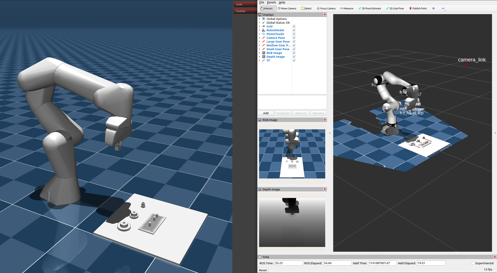

# Mujoco Ros2 Control

The MuJoCo ROS 2 control hardware interface is designed to enable seamless integration between MuJoCo, a high-performance physics engine, and ROS 2, a widely used middleware for robotic systems. This interface provides a robust and efficient solution for leveraging MuJoCo’s powerful simulation capabilities within the ROS 2 ecosystem, enabling realistic physics-based robot simulation and control.

**software name:** Mujoco Ros2 Control

Mujoco Ros2 Control was initiated and is currently developed at the
[Robotics Innovation Center](http://robotik.dfki-bremen.de/en/startpage.html) of the
[German Research Center for Artificial Intelligence (DFKI)](http://www.dfki.de) in Bremen.


## Motivation
The development and testing of control algorithms for robotic systems is a crucial step in ensuring their reliability, safety, and efficiency. However, conducting these tests on physical hardware can be expensive, time-consuming, and prone to mechanical wear and tear. To overcome these challenges, accurate and efficient physical simulations have become an indispensable tool for researchers, engineers, and roboticists. These simulations enable comprehensive testing of robot controllers, planning algorithms, and perception systems in a controlled, repeatable, and risk-free environment.

## Getting Started
To use MuJoCo Ros2 control, you must create a launchfile (you can use the examples as reference):
### 1. Generate MJCF Using `xacro2mjcf.py` Node
- Add the `xacro2mjcf.py` node in your launch file to create the MJCF file at launch time.
- **Required setup:**
  - Use **absolute paths** for all file references.
  - Or pass `robot_description` as a **string parameter** (not a file path).
  - Set:
    - `output_file`: full path to the generated `.xml` MJCF file.
    - `mujoco_files_path`: directory where MJCF and related files will be stored.
      - **⚠️ `output_file` must be inside `mujoco_files_path`.**


### 2. Required Parameters for `mujoco_ros2_control` Node
| Parameter              | Description                                       |
|------------------------|---------------------------------------------------|
| `robot_description`    | URDF string (not a file path)                     |
| `robot_model_path`     | Path to the generated MJCF `.xml` file            |
| ROS 2 control YAML     | Path to controller config (e.g., `*.yaml`)        |


### Launch Flow
- Launch `xacro2mjcf.py` first.
- After it exits, launch `mujoco_ros2_control`.
- Then load controllers (e.g., via `spawner` nodes).

For the urdf creation you can take a look at 

## Examples
We provide one example with the franka description and the gears from the IndustRealKit that can be started with ```ros2 launch franka_mujoco franka.launch.py```


and one example with a unitree H1 that can be started with ```ros2 launch unitree_h1_mujoco unitree_h1.launch.py```


### Docker
To start you can use the  to create a docker container with MuJoCo Ros2 control and its examples.
```docker build -t "mujoco_ros2_control" .```

To try out the examples you can follow this steps to run a container with mujoco_ros2_control and its examples:
```bash
# Build the container
docker build docker build -t "mujoco_ros2_control" .
# create the network for the container
docker network create ros
#give permissions to use X11 with docker 
xhost +local:docker
# starts the container with the franka example
docker run \
    --network="ros" \
    --device="/dev/dri:/dev/dri" \
    --env DISPLAY=$DISPLAY \
    --volume /tmp/.Xdocker \
    -v /tmp/.X11-unix:/tmp/.X11-unix \
    -it mujoco_ros2_control bash
xhost -local:docker
```


## Requirements / Dependencies
```
libglfw3-dev
libx11-dev
xorg-dev
ros-humble-urdf
ros-humble-xacro
ros-humble-rviz2
ros-humble-ros2-control
ros-humble-ros2-controllers
ros-humble-controller-manager
ros-humble-pcl-ros
ros-humble-perception-pcl
libopencv-dev
ros-humble-pcl-conversions
ros-humble-cv-bridge
libpcl-dev
ros-humble-urdfdom-py
```

## Installation
To use the **MuJoCo ROS2 Control**, follow these steps:
1. Install [ROS2 Humble](https://docs.ros.org/en/humble/Installation.html)
2. Install the Dependencies <br />
   ``` bash
   $ apt-get update && apt-get install -y \
        git \
        libglfw3-dev \
        libx11-dev \
        xorg-dev \
        ros-humble-urdf \
        ros-humble-xacro \
        ros-humble-rviz2 \
        ros-humble-ros2-control \
        ros-humble-ros2-controllers \
        ros-humble-controller-manager \
        ros-humble-pcl-ros \
        ros-humble-perception-pcl \
        ros-humble-urdfdom-py \
        libopencv-dev \
        ros-humble-pcl-conversions \
        ros-humble-cv-bridge \
        libpcl-dev
   ```
3. Build the ros package.
   ```bash
    git clone <package url>
    colcon build
   ```

## Documentation
Run ```doxygen Doxyfile``` in the mujoco_ros2_control directory

## Bug Reports

To search for bugs or report them, please use GitHubs issue tracker at:

[//]: <> (TODO put a link to the issue tracker here)

## Releases

### Semantic Versioning

Semantic versioning must be used, that is, the major version number will be
incremented when the API changes in a backwards incompatible way, the minor
version will be incremented when new functionality is added in a backwards
compatible manner, and the patch version is incremented for bugfixes,
documentation, etc.

## License
Mujoco Ros2 Control is distributed under the [3-clause BSD license](https://opensource.org/licenses/BSD-3-Clause).

## Maintainer / Authors / Contributers
Adrian Danzglock,       adrian.danzglock@dfki.de \
Vamsi Krishna Origanti, vamsi.origanti@dfki.de

Copyright 2025, DFKI GmbH / Robotics Innovation Center

[//]: <> (if the software is a result of a cooperation of the DFKI  RIC and the Robotics Research Group.)
t)

## Funding
MuJoCo ROS2 Control was initiated and developed at Robotics Innovation Center, German Research Center for Artificial Intelligence (DFKI GmbH) at Bremen, Germany as part of the HARTU Project. This project has received funding from the European Union’s research and innovation program Horizon Europe under grant agreement No. 101092100.

](https://eufunds.me/wp-content/uploads/2021/09/EU-flag-Horizon-Europe.jpg)
