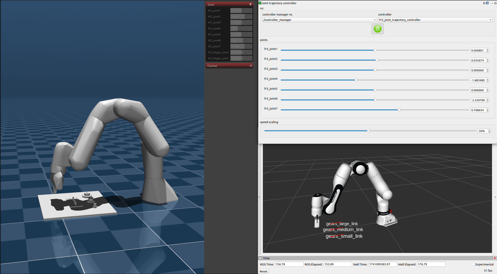
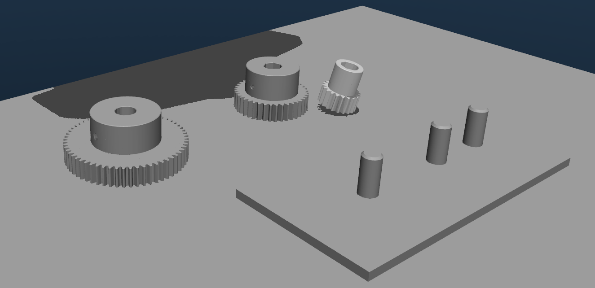

# Summary
The Mujoco ROS 2 control [@ros2_control] hardware interface enables the use of Mujoco [@todorov2012mujoco] with ROS 2. 
The implementation of the system interface is partially based on the gz_ros2_control implementation. However, unlike gz_ros2_control, the interface is designed as a standalone class. To facilitate the use of URDF files in Mujoco, a URDF-to-MJCF conversion Python script has been developed. This script can generate an MJCF file with the desired attributes and sensors from one or multiple URDF files.

# Related Work
gazebo_ros2_control[@gazebo_ros2_control] and gz_ros2_control[@gz_ros2_control] are the most frequently used wrappers to connect ROS 2 with a physics engine. They enable seamless integration between the Robot Operating System (ROS 2) control architecture and the Gazebo simulation environment.

Both wrappers create a hardware interface for the ROS 2 control framework, which can be used to control either Gazebo [@Koenig-2004-394] Classic (gazebo_ros2_control) or the latest version of Gazebo (gz_ros2_control) directly from ROS 2. This means that robot models can not only be simulated, but also controlled and tested in a realistic manner.

A central component of these wrappers is the support for various actuators and joints, which can be moved and controlled within the simulation. In addition, both systems offer flexible expandability through a plug-in system that allows a wide variety of sensors to be defined in the URDF (Unified Robot Description Format) file and loaded into the simulation.

Supported sensors include cameras, LIDARs, IMUs (Inertial Measurement Units) and force-torque sensors, which can be seamlessly integrated into the ROS 2 ecosystem. This enables not only the testing of control algorithms, but also the validation of sensor fusion techniques and perception algorithms in a virtual environment.

Thanks to the close integration with ROS 2 Control, these wrappers offer a powerful solution for developers who want to simulate robot systems in a physically realistic environment before transferring them to real hardware.

# Statement of need
The development and testing of control algorithms for robotic systems often requires accurate and efficient physical simulations. Simulators are an important tool for researchers and practitioners. They enable the training of reinforcement learning (RL) strategies, the testing of controllers and the refinement of robot designs without the need for physical hardware. However, many of the existing physics engines integrated into ROS2 (Robot Operating System 2) lack the precision, computational power and flexibility required to simulate complex kinematic robots with realistic dynamics.

MuJoCo is a state-of-the-art physics engine known for its accurate handling of rigid body dynamics and computational efficiency, making it an excellent choice for simulating robotic systems. However, direct integration with ROS2, a middleware widely used in robotics, is limited. This gap prevents researchers from utilizing MuJoCo's capabilities in ROS2-based workflows.

Our software, MuJoCoROS2Control, bridges this gap by providing an intuitive and functional interface for using MuJoCo as a physics engine in ROS2 environments. The interface supports key robot sensors such as Pose and ft-sensors and enables realistic perception-based simulations (additional sensors can be integrated when there is a mujoco sensor for the purpose). The main focus is on enabling robust simulations for kinematic robots and providing a platform where users can train reinforcement learning algorithms and test controllers with high accuracy.

# Implementation
## General Structure

Mujoco_ros2_control is essentially composed of four main components:

1. Preparation of the robot description
  - Because ros uses the URDF file format to describe the robot and mujoco uses the MJCF file format, it was required to convert a urdf to mjcf with passing important options and not by urdf supported features to mjcf by using our own urdf 2 mjcf scripts.
  With this scripts it is possible to have fixed joints (that arent merged to a single object) in mjcf and it is possible to declare sensors and other mujoco specific stuff in the urdf, to initialize it in the mujoco simulation.
  <figure>
    
    <figcaption>Figure 1: Flow diagram of the inputs and outputs of the xacro2mjcf script</figcaption>
  </figure>

  - Because MuJoCo uses convex hulls to represent the collision surface of objects, the resolution of the collsions of objects are often not like expected (by filigran parts like teeths of a gear). To overcome this problem, we use CoACD [@wei2022coacd] to split a single mesh into multiple smaller meshes, where the convex hull is much more accurate.
  
  
1. ROS 2 Control
  - This component provides the ROS 2 hardware interface and allows the use of Mujoco actuators for joint control (in addition to standard torque control). Furthermore, this component publishes the system time and visualizes the other two components (sensors and GUI).
  - It uses the SystemInterface from ros2 control to update the state and command interfaces required for ros2. The actual state is read from mujocos data object that holds the actual state in form of $q$ (qpos for position), $qd$ (qvel for velocity), and $\tau$ (qfrc_applied for effort).
  - Because Mujoco uses applied torques to control the joints internal, we integrated a optional simple pid controller for combinations of position, velocity and acceleration command interfaces as alternative to the usage of mujocos actuators (that can be defined in the mjcf).

2. Sensors
  Sensors are launched as independent nodes in ROS 2. Apart from the camera sensor, they utilize a sensor class that individual sensor classes can inherit from, enabling easy integration of additional sensors. Each sensor has access to the pointers of mujoco to read the values from mujoco outside of the ros2 control loop.

3. Visualization (GUI)
  The visualization utilizes the GUI from the Simulate.cc example of Mujoco, which is incorporated as an external library.
<figure>
  
  <figcaption>Figure 2: Simplified Class diagram mujoco_ros2_control</figcaption>
</figure>

## Helper Scripts
Because mujoco uses mjcf and not urdf as input model and the default structure of a mjcf don't include fixed joints (they are merged), we created our own converter to create a mjcf from one or multiple urdf files. This conversion makes sure that we can use a urdf from ros that is also used by the controller manager, is used in mujoco. Because the urdf format don't provide all optional elements of mjcf, it is possible to add additional options or elements to an existing element, by refering it in the mujoco element of the urdf.

# Examples
## Franka FR3 with IndustRealKit Gears
In this example we show how to use a Franka FR3 from the official robot description [@franka_description] together with high detailed gears from the IndustRealKit [@tang2023industreal].
In this example we use the [MuJoCo actuators](https://mujoco.readthedocs.io/en/latest/computation/index.html#geactuation) to generate the actuated joint torques, but it is also possible to use a PID controller via the ros2_control xacro config or direct torque control.
<figure>
  
  <figcaption>Figure 3: Franka FP3 controlled with ros2 joint trajectory controller</figcaption>
</figure>
To get the hight resolution collisions in mujoco, we use CoaCD [@wei2022coacd] to create multiple meshes from a single mesh, to have more detailed convex hulls around the shape of the object in mujoco (the replacement of the single mesh file with the new mesh files is done by the Xacro2Mjcf script, when the generated files are in a folder at the same place as the original mesh).
<figure>
  
  <figcaption>Figure 4: Convex hull inside mujoco for the gears of the IndustRealKit [@tang2023industreal]</figcaption>
</figure>

## Unitree H1
In this example we use the [Unitree H1 description](https://github.com/unitreerobotics/unitree_ros/blob/master/robots/h1_description/urdf/h1_with_hand.urdf) with 51 DoG in a floating base (robot stands on ground) environment together with mujoco actuators to control the joints with joint position command interfaces.
<figure>
  
  <figcaption>Figure 5: Unitree H1 with floating joint between world and pelvis</figcaption>
</figure>

## [IMRK](https://robotik.dfki-bremen.de/de/forschung/robotersysteme/imrk)
In this example we use imrk system of the DFKI Bremen. This Robot consist of two [Kuka LBR iiwa 14](https://www.kuka.com/-/media/kuka-downloads/imported/8350ff3ca11642998dbdc81dcc2ed44c/0000246833_en.pdf) and in this example we use a torque controller for both arms, position controllers with mujoco actuators for the robotiq grippers and Force Torque sensors for both end effectors.
<figure>
  
  <figcaption>Figure 6: IMRK with robotiq 2f Gripper and Robotiq FT300 Sensor</figcaption>
</figure>
(The robot is not included in the examples, because the robot description is only internal available)

# Acknowledgements
This research work was conducted as part of the HARTU Project. This project has received funding from the European Union’s research and innovation program Horizon Europe under grant agreement No. 101092100.

# Figures

<figure>
  
  <figcaption>Figure 7: Class diagram of mujoco_ros2_control</figcaption>
</figure>

<!-- TODO -->
# References

