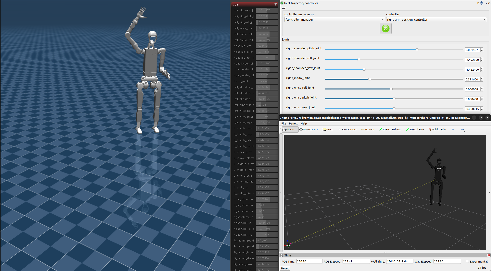

# Summary
The MuJoCo ROS 2 control [@ros2_control] hardware interface is designed to enable seamless integration between MuJoCo [@todorov2012mujoco], a high-performance physics engine, and ROS 2, a widely used middleware for robotic systems. This interface provides a robust and efficient solution for leveraging MuJoCo’s powerful simulation capabilities within the ROS 2 ecosystem, enabling realistic physics-based robot simulation and control.

The implementation of the system interface is partially inspired by the gz_ros2_control framework, which facilitates the connection between ROS 2 and the Gazebo simulation environment. However, unlike gz_ros2_control [@gz_ros2_control], which is tightly coupled with Gazebo, MujocoROS2Control is designed as a standalone class. This architectural choice ensures greater flexibility, allowing users to incorporate MuJoCo into their ROS 2-based workflows without dependencies on Gazebo. Additionally, this design simplifies extensibility, making it easier to adapt the interface for different robotic platforms and simulation scenarios.

To facilitate the seamless use of URDF (Unified Robot Description Format) files within MuJoCo, a dedicated URDF-to-MJCF conversion Python script has been developed. This script automates the process of translating URDF files into MJCF (MuJoCo XML format), ensuring that robot models designed for ROS 2 can be efficiently simulated in MuJoCo. The script not only converts kinematic and dynamic properties but also allows the inclusion of custom attributes and sensor definitions. This capability enables users to generate MJCF files with the desired physical properties, sensors, and additional MuJoCo-specific parameters from one or multiple URDF files, ensuring an accurate and adaptable simulation setup.

By providing this hardware interface and conversion tool, MujocoROS2Control bridges the gap between ROS 2 and MuJoCo, offering a streamlined workflow for robotic simulation, controller testing, and reinforcement learning applications.

# Related Work
gazebo_ros2_control[@gazebo_ros2_control] and gz_ros2_control[@gz_ros2_control] are the most frequently used wrappers to connect ROS 2 with a physics engine. They enable seamless integration between the Robot Operating System (ROS 2) control architecture and the Gazebo simulation environment.

Both wrappers create a hardware interface for the ROS 2 control framework, which can be used to control either Gazebo [@Koenig-2004-394] Classic (gazebo_ros2_control) or the latest version of Gazebo (gz_ros2_control) directly from ROS 2. This means that robot models can not only be simulated, but also controlled and tested in a realistic manner.

A central component of these wrappers is the support for various actuators and joints, which can be moved and controlled within the simulation. In addition, both systems offer flexible expandability through a plug-in system that allows a wide variety of sensors to be defined in the URDF (Unified Robot Description Format) file and loaded into the simulation.

Supported sensors include cameras, LIDARs, IMUs (Inertial Measurement Units) and force-torque sensors, which can be seamlessly integrated into the ROS 2 ecosystem. This enables not only the testing of control algorithms, but also the validation of sensor fusion techniques and perception algorithms in a virtual environment.

Thanks to the close integration with ROS 2 Control, these wrappers offer a powerful solution for developers who want to simulate robot systems in a physically realistic environment before transferring them to real hardware.

# Statement of need
The development and testing of control algorithms for robotic systems is a crucial step in ensuring their reliability, safety, and efficiency. However, conducting these tests on physical hardware can be expensive, time-consuming, and prone to mechanical wear and tear. To overcome these challenges, accurate and efficient physical simulations have become an indispensable tool for researchers, engineers, and roboticists. These simulations enable comprehensive testing of robot controllers, planning algorithms, and perception systems in a controlled, repeatable, and risk-free environment.

### Simulators play a vital role in various robotics applications, including but not limited to:

Training reinforcement learning (RL) policies in a safe and scalable manner, where thousands of virtual training episodes can be executed in parallel without real-world constraints.
Developing and fine-tuning robot controllers, allowing engineers to refine motion planning, feedback control, and trajectory optimization before deployment on real robots.
Validating hardware and software designs, ensuring that new robotic platforms can be thoroughly tested in different environments before being built.
Enhancing perception and sensor fusion techniques, where realistic sensor models provide simulated input for computer vision, LiDAR processing, and haptic feedback algorithms.
However, while ROS 2 (Robot Operating System 2) has become the standard middleware for robotic software development, many existing physics engines integrated with ROS 2, such as Gazebo, Bullet, and ODE, face limitations in terms of simulation accuracy, computational efficiency, and extensibility. These engines, while widely used, often struggle with complex kinematic structures, high-fidelity force interactions, and real-time computational constraints. As a result, researchers and developers may encounter difficulties when simulating robots that require precise force-based control, dynamic contact modeling, or realistic sensor feedback.

### Why MuJoCo?
MuJoCo (Multi-Joint Dynamics with Contact) is a state-of-the-art physics engine that is widely recognized for its ability to simulate highly articulated robots with precise rigid-body dynamics. Originally designed for robotic control, biomechanics, and reinforcement learning applications, MuJoCo offers several advantages over traditional physics engines:

Accurate handling of multi-body dynamics with superior numerical integration methods.
Fast and efficient computation, enabling high-speed simulation and parallelized training for machine learning applications.
Advanced contact modeling that allows for realistic interactions between rigid bodies, friction, and soft constraints.
Flexible actuator models, supporting both torque control and position-velocity-based actuation.
Rich sensor support, providing simulated force-torque sensors, IMUs, and camera-based perception.
Despite these advantages, MuJoCo lacks native integration with ROS 2, limiting its direct usability in standard robotic workflows. Researchers and developers using ROS 2-based frameworks cannot fully leverage MuJoCo’s capabilities without a dedicated interface that connects MuJoCo’s powerful physics engine to the ROS 2 ecosystem.

### MujocoROS2Control: Bridging MuJoCo and ROS 2
To address this gap, we introduce MujocoROS2Control, a software framework that provides an intuitive and functional hardware interface for integrating MuJoCo as a physics engine within ROS 2 environments. This interface facilitates realistic robotic simulations while ensuring compatibility with standard ROS 2 control frameworks.

### Key features of MujocoROS2Control include:

* Seamless integration of MuJoCo with ROS 2, enabling direct communication between ROS 2 controllers and the MuJoCo physics engine.
* Support for key robotic sensors, such as Pose estimation sensors, force-torque (ft) sensors, and other MuJoCo-supported sensing modalities. Additional sensors can be integrated based on MuJoCo’s sensor framework.
* Robust simulation for kinematic robots, ensuring accurate modeling of robot dynamics, control behaviors, and sensor feedback.
* A flexible architecture, allowing researchers to customize their simulations, define new sensor models, and fine-tune physics parameters as per their requirements.
* A reinforcement learning-friendly environment, where users can train RL policies using MuJoCo’s efficient physics engine while maintaining ROS 2 compatibility.
* By providing a high-fidelity, physics-based simulation framework that seamlessly integrates with ROS 2, MujocoROS2Control enables researchers and engineers to train, test, and validate robotic controllers with unprecedented accuracy. This tool is especially beneficial for applications that require force-based manipulation, trajectory optimization, reinforcement learning, and advanced perception-based control strategies.

With MujocoROS2Control, developers can harness the best of both worlds—the powerful dynamics simulation of MuJoCo and the modularity and flexibility of ROS 2, paving the way for next-generation robotic research and development.

# Implementation

## General Structure

The **MujocoROS2Control** framework is composed of four key components, each playing a crucial role in enabling **seamless integration between MuJoCo and ROS 2**:

### 1. Robot Description Preparation

Since **ROS 2** utilizes the **URDF (Unified Robot Description Format)** for defining robot models, while **MuJoCo** relies on its own **MJCF (MuJoCo XML format)**, a conversion process is necessary to bridge the gap between these two formats. To facilitate this transition, we have developed **custom URDF-to-MJCF conversion scripts**, ensuring compatibility between ROS-based robot descriptions and MuJoCo simulations.

Key aspects of this conversion process include:

- **Preserving fixed joints**: Unlike MuJoCo, where fixed joints are typically merged into a single entity, our conversion method retains the structure of **fixed joints** as defined in URDF, ensuring accurate representation in MJCF.
- **Custom sensor integration**: The script allows the declaration of **additional sensors** and **MuJoCo-specific attributes** directly within the URDF. This enables seamless initialization and utilization of **force-torque sensors, IMUs, cameras**, and other perception-related components in the MuJoCo simulation.
- **Extending robot attributes**: Since MuJoCo supports **custom properties and dynamic settings**, our converter enables users to enrich the robot model by defining **physical parameters, actuator properties, and additional attributes** that are otherwise unavailable in standard URDF descriptions.

#### URDF-to-MJCF Conversion Workflow
The following figure illustrates the **input-output structure** of the **URDF-to-MJCF (xacro2mjcf) script**, detailing how **ROS-based URDF models** are transformed into **MuJoCo-compatible MJCF files**.

<figure>
  
  <figcaption>Figure 1: Flow diagram of the inputs and outputs of the xacro2mjcf script</figcaption>
</figure>

##### Collision Handling in MuJoCo
MuJoCo represents **collision surfaces** using **convex hull approximations**, which may lead to inaccuracies when simulating **intricate mechanical parts**, such as **gear teeth and complex robot end-effectors**. To mitigate this issue, we employ **CoACD** [@wei2022coacd], a tool that **decomposes complex meshes into smaller convex sub-meshes**, allowing for a more precise and **realistic collision representation** within MuJoCo.

---

### 2. ROS 2 Control Integration

This component provides the **ROS 2 hardware interface**, enabling **joint control and actuation** using MuJoCo's physics engine. The integration follows the **ROS 2 control framework**, making it compatible with standard **ROS controllers and planners**.

Key features of the ROS 2 control integration:
- **Support for MuJoCo actuators**, allowing both **direct torque control** and **higher-level control strategies**.
- **System time synchronization**, ensuring that MuJoCo operates **in step with ROS 2's timing system**.
- **Visualization of sensor data**, integrating the simulation with real-time ROS topics.

#### Internal Working
The **SystemInterface** from ROS 2 control is used to **update the state and command interfaces**, ensuring that MuJoCo interacts with ROS-based controllers effectively.

The following **MuJoCo state variables** are utilized:
- **$q$ (qpos)** → Represents the **position** of the robot joints.
- **$qd$ (qvel)** → Represents the **velocity** of each joint.
- **$\tau$ (qfrc_applied)** → Represents the **applied forces/torques**.

Since MuJoCo inherently operates with **torque-based control**, we have also implemented an **optional PID controller** that allows users to control joints using **position, velocity, or acceleration commands**, making it more flexible for different control strategies.

---

### 3. Sensor Integration

MuJoCo provides a **diverse set of sensor models**, and **MujocoROS2Control** extends this functionality by offering a flexible and modular **ROS 2 sensor interface**.

#### Key Features:
- **Independent ROS 2 nodes**: Each sensor runs as a **dedicated ROS node**, ensuring modularity and easy debugging.
- **Inheritance-based sensor design**: We provide a **base sensor class** that allows users to **easily integrate new sensors** into the system.
- **Direct MuJoCo state access**: Each sensor reads its **values directly from MuJoCo’s data structures**, ensuring real-time updates with minimal computation overhead.

Supported sensors include:
- **Force-Torque (FT) sensors**
- **IMUs (Inertial Measurement Units)**
- **Cameras (RGB, Depth, and RGBD)**
- **Custom sensors defined in MuJoCo**

Unlike traditional **ROS 2 control loops**, our sensor integration runs **outside the ROS 2 control cycle**, preventing **synchronization delays** and ensuring **accurate real-time sensor feedback**.

---

### 4. Visualization and GUI

To facilitate **real-time monitoring and debugging**, **MujocoROS2Control** incorporates a **Graphical User Interface (GUI)** native to the MuJoCo. The visualization utilizes the **GUI from the [Simulate](https://github.com/google-deepmind/mujoco/tree/main/simulate) example**, which has been adapted as an **external library** within our system. This provides **intuitive visualization** of the robot and sensor data.

#### GUI Features:
- **Real-time 3D visualization** of the robot in MuJoCo.
- **Overlay of sensor data**, such as force-torque readings and camera views.
- **Interactive simulation control**, allowing users to interact, pause, resume, and modify simulation parameters.
## System Architecture and Class Structure
The class structure of MujocoROS2Control is designed to keep different functional components modular and independent while allowing seamless interaction. The diagram below illustrates the core classes and their interactions, showing how the URDF-MJCF converter, ROS 2 control interface, sensor integration, and visualization components are structured within the framework.
<figure>
  
  <figcaption>Figure 2: Simplified class diagram of MujocoROS2Control</figcaption>
</figure>

---

## Helper Scripts

To ensure seamless compatibility between **ROS 2 and MuJoCo**, we provide several **helper scripts** that assist in **URDF-to-MJCF conversion**, **collision processing**, and **sensor integration**.

### URDF-to-MJCF Conversion
Since MuJoCo **does not natively support URDF**, we developed a **custom converter** that transforms **one or multiple URDF files** into a **single MJCF file**, ensuring proper compatibility with MuJoCo.

Key aspects of the conversion:
- **Fixed Joint Handling**: Ensures that **fixed joints from URDF** are **not merged** in MJCF, preserving their original structure.
- **Attribute Augmentation**: Since URDF lacks **certain MuJoCo attributes**, users can specify **additional options** within the MuJoCo section of the URDF to **extend functionality**.

By incorporating these **helper scripts**, users can seamlessly **integrate ROS 2 robot models into MuJoCo**, making the transition between simulation environments smooth and efficient.

# Examples
## Franka FR3 with IndustRealKit Gears
In this example we show how to use a Franka FR3 from the official robot description [@franka_description] together with high detailed gears from the IndustRealKit [@tang2023industreal].
In this example we use the [MuJoCo actuators](https://mujoco.readthedocs.io/en/latest/computation/index.html#geactuation) to generate the actuated joint torques, but it is also possible to use a PID controller via the ros2_control xacro config or direct torque control.
<figure>
  
  <figcaption>Figure 3: Franka FP3 controlled with ros2 joint trajectory controller</figcaption>
</figure>
To get the hight resolution collisions in mujoco, we use CoaCD [@wei2022coacd] to create multiple meshes from a single mesh, to have more detailed convex hulls around the shape of the object in MuJoCo (the replacement of the single mesh file with the new mesh files is done by the Xacro2Mjcf script, when the generated files are in a folder at the same place as the original mesh).
<figure>
  
  <figcaption>Figure 4: Convex hull inside MuJoCo for the gears of the IndustRealKit [@tang2023industreal]</figcaption>
</figure>
For simple perception tasks there is a OpenGL RGBD camera, that can be defined in the URDF.
<figure>
  
  <figcaption>Figure 5: RGBD Camera inside of mujoco</figcaption>
</figure>

## Unitree H1
In this example we use the [Unitree H1 description](https://github.com/unitreerobotics/unitree_ros/blob/master/robots/h1_description/urdf/h1_with_hand.urdf) with 51 DoG in a floating base (robot stands on ground) environment together with MuJoCo actuators to control the joints with joint position command interfaces.
<figure>
  
  <figcaption>Figure 6: Unitree H1 with floating joint between world and pelvis</figcaption>
</figure>

## [IMRK](https://robotik.dfki-bremen.de/de/forschung/robotersysteme/imrk)
In this example we use imrk system of the DFKI Bremen. This Robot consist of two [Kuka LBR iiwa 14](https://www.kuka.com/-/media/kuka-downloads/imported/8350ff3ca11642998dbdc81dcc2ed44c/0000246833_en.pdf) and in this example we use a torque controller for both arms, position controllers with MuJoCo actuators for the robotiq grippers and Force Torque sensors for both end effectors.
<figure>
  
  <figcaption>Figure 7: IMRK with robotiq 2f Gripper and Robotiq FT300 Sensor</figcaption>
</figure>
(The robot is not included in the examples, as the robot description is available only for internal use.)

# Acknowledgements
This library was initiated and developed at Robotics Innovation Center, German Research Center for Artificial Intelligence (DFKI GmbH) at Bremen, Germany as part of the HARTU Project. This project has received funding from the European Union’s research and innovation program Horizon Europe under grant agreement No. 101092100.

<!---
# Attachements
<figure>
  
  <figcaption>Figure 8: Class diagram of mujoco_ros2_control</figcaption>
</figure>
-->
# References