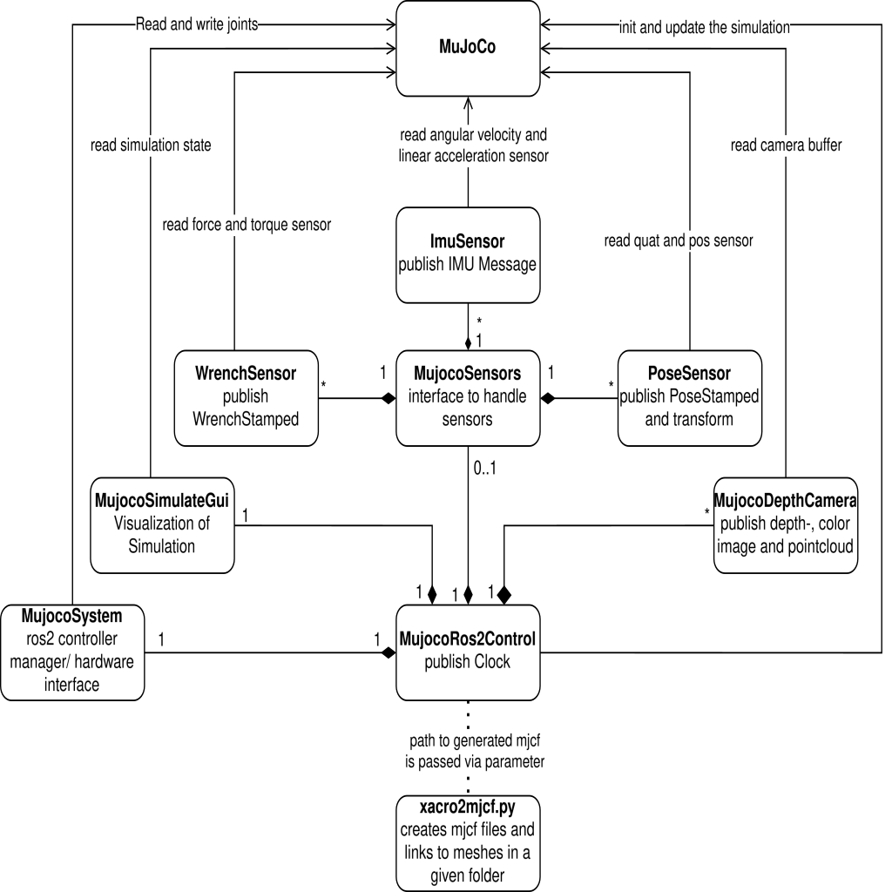

# Summary

The `MujocoROS2Control` hardware interface enables seamless integration between MuJoCo [@todorov2012mujoco], a high-performance physics engine, and ROS 2 [@ros2_control], a widely adopted middleware for robotic systems. This interface provides an efficient solution for simulating and controlling robots using MuJoCo’s physics capabilities within the ROS 2 ecosystem.

To support ROS-based workflows, we developed a dedicated URDF-to-MJCF conversion script. This tool translates URDF models into MJCF (MuJoCo XML format), preserving kinematic and dynamic properties and allowing custom MuJoCo-specific parameters such as sensors, actuators, and collision definitions to be specified directly in the URDF. This conversion ensures compatibility and adaptability for simulation.

`MujocoROS2Control` bridges the gap between ROS 2 and MuJoCo, offering a streamlined workflow for simulation, controller testing, and reinforcement learning.

# Statement of Need

Developing and validating control algorithms for robotic systems often requires extensive testing, which on physical hardware can be expensive, time-consuming, and subject to wear. Accurate simulation environments are essential for safe and scalable development.

MuJoCo (Multi-Joint dynamics with Contact) is a fast and accurate physics engine designed for robotics, control, biomechanics, and reinforcement learning. It provides precise multi-body dynamics with advanced numerical integration, High-speed simulation for real-time control and machine learning, Sophisticated contact modeling and soft constraint handling, Flexible actuator models and comprehensive sensor support.

MuJoCo is ideal for reliable torque feedback due to its high-fidelity torque-controlled joints and smooth-contact soft constraint solver, which enables precise compliance behavior [@zhang2025wholebodymodelpredictivecontrollegged].

Gazebo, on the other hand, typically relies on hard-constraint engines like ODE or Bullet, which struggle with compliant torque-based tasks unless carefully tuned. These engines often require smaller timesteps than MuJoCo to maintain stability [@gazebo_physics].

Drake supports torque control, but due to its symbolic and rigid-body emphasis, tuning compliance can be computationally intensive [@drake_mit].

<!-- Due to high-fidelity torque-controlled joints and its smooth-contact soft constraint solver is Mujoco ideal for a reliable torque feedback combined with precise compliance behavior.
Gazebo relies typicaly on hard-contraint eingines like ODE or Bullet, with struggle with compliant torque based tasks unless they are carefully tuned (often require smaller timesteps than mujoco for stability).
Drake on the other hand supports torque control, however due to its symbolic and rigid-body emphasis, tuning compliance can be more computationally heavy. -->

| Controller Type | **MuJoCo** | **Gazebo/Ignition** | **Drake** |
| :-- | :-: | :-: | :-: |
| **Torque-based impedance** | High-fidelity, fast, stable | Accurate but tuning required | Accurate, symbolic, slower than mujoco |
| | | |
| **Admittance with wrench input** | Stable, smooth compliant | Plugin-lag, tuning required | precise, heavier computationally |
| | | |
| **Time-step flexibility** | Larger stable steps (e.g. 2-5ms) | Smaller steps required (1ms) | Variable but slower dynamics |

Table: Comparison of usability of different Simulators for usage with Compliant controllers

| Feature | **Mujoco ROS2 Control** | **mujoco ros2 control [@mujoco_ros2_control]** | **gz ros2 control [@gz_ros2_control]** | **drake-ros [@drake_ros]** |
| :-- | :-: | :-: | :-: |:-:|
| Simulation Engine | MuJoCo | MuJoCo | Gazebo | Drake |
| Sensor Support | Yes, IMU, Pose, Wrench, RGBD | No, Planned | Yes, Supports various sensors via Gazebo plugins | Yes, but aditional code is required |
| URDF Support | Yes, direct loading from URDF via urdf to mjcf script in launchfile | No, Planned | Yes, Uses URDF/SDF for robot models | Yes, Supports URDF and custom formats |
| Control System | ros2_control | ros2_control | ros2_control | Experimental API for ROS2 |
| Control Methods | PID, Mujoco Actuators, Torque | PID, Torque, not integrated position and velocity control | PID, Effort, Position, Velocity | PID, Optimazation-based-control |
| Mimic Joints | Yes | Yes | Yes, sometimes difficoult to setup [@gazebo_ros2_mimic_joints] | Yes |

Table: Comparison of actual ros2 simulator wrappers

Despite these capabilities, MuJoCo lacks native support for ROS 2, limiting its adoption in modern robotic development pipelines. `MujocoROS2Control` addresses this gap, enabling users to simulate ROS 2-compatible robots in MuJoCo with minimal overhead.

# Implementation

`MujocoROS2Control` integrates MuJoCo with the `ros2_control` framework. A key component is the URDF-to-MJCF converter, which maintains fixed joints which MuJoCo typically collapses, allows sensor and actuator tags within URDFs, and generates MJCF files compatible with MuJoCo’s expectations.

The interface supports direct torque control, PID-based position/velocity/acceleration control and MuJoCo’s native actuator models.

Joint states and simulation time are published for synchronization with the ROS 2 system time (`/clock`). Sensors defined in the URDF are exposed as individual ROS nodes using `realtime_tools` [@realtime_tools] to maintain real-time performance.

# Use Cases
MujocoRos2Control was utilized for testing and validating various torque and admittance controllers within the scope of the HARTU project [@hartu_project]. The software also played a key role in conducting experiments for the publication "Look-Ahead Optimization for Managing Nullspace in Cartesian Impedance Control of Dual-Arm Robots" [@Origanti2025].

Our framework has been successfully employed to test components such as force-torque sensor gravity compensation, torque-based Cartesian controllers, and Dynamic Movement Primitives (DMP)-based skill reproduction [@Fabisch2024].

# Examples

## Franka FR3 with IndustRealKit Gears

This example integrates the Franka FR3 robot [@franka_description] with high-resolution gear models from the IndustRealKit [@tang2023industreal]. MuJoCo actuators are used to generate joint torques, although the implemented PID control and torque control are also supported.
For the high-resolution collision modeling, we use CoaCD [@wei2022coacd] to create multiple convex hulls from complex mesh geometry. The URDF-to-MJCF converter automatically replaces original mesh files in the mjcf, when the converted files are in the same directory.

## Unitree H1

This example uses the loads the Bipedal robot Unitree H1 [@unitree_ros] with a floating base and tf2 transformations from world to pelvis. All joints are controlled via ros2 control, with mujoco actuators for position and velocity control (PD Control).

## IMRK System

In this example, we simulate the iMRK system developed at DFKI Bremen, consisting of two KUKA LBR iiwa 14 robots [@Mrongaimrk]. A ROS2 Cartesian impedance controller (migrated version of [@mayr2024cartesian]) is used for each arm. MuJoCo actuators manage the Robotiq 2F grippers, and force-torque sensors are simulated at both end-effectors. 
Because the robot description for the IMRK system is not public available, we cant provide the files for this example.

# Conclusion

`MujocoROS2Control` enables high-fidelity robotic simulation by integrating MuJoCo with ROS 2. Through its robust conversion utilities, sensor bridging, and actuator support, it provides a reliable framework for control development, validation, and machine learning research.

Its lightweight design and fast simulation performance make it well-suited for force-based control, trajectory optimization, and reinforcement learning applications. Future enhancements may include support for additional sensor types, multi-robot coordination, and real-time closed-loop learning.

# Acknowledgements

This library was initiated and developed at the Robotics Innovation Center, German Research Center for Artificial Intelligence (DFKI GmbH), Bremen, Germany, as part of the HARTU Project. This project received funding from the European Union’s Horizon Europe research and innovation program under grant agreement No. 101092100.

# References
